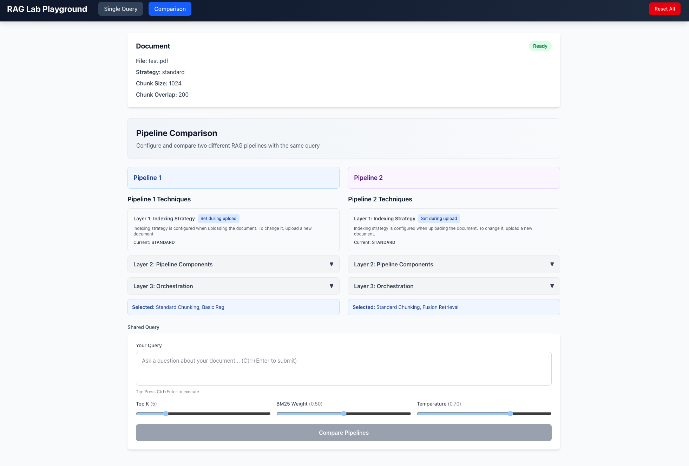

# RAG-Lab

Local-first RAG experimentation platform for testing and comparing retrieval techniques. Experiment with different indexing strategies, retrieval methods, query expansion techniques, and orchestration approaches to understand how they impact retrieval quality and performance.

## Purpose

This application provides a comprehensive playground for experimenting with Retrieval-Augmented Generation (RAG) techniques. Users can test individual RAG pipelines to see how data is retrieved, or run comparison mode to evaluate up to two different RAG pipelines side-by-side and analyze differences in results, retrieval quality, and performance metrics.





## Key Features

### Single RAG Mode

Test individual RAG pipelines with full control over technique selection:
- **Indexing Strategies**: Standard chunking, parent document, semantic chunking, headers-based, proposition-based
- **Retrieval Methods**: Basic vector search, hybrid (vector + BM25 fusion)
- **Query Expansion**: HyDE (Hypothetical Document Embeddings)
- **Filtering & Post-processing**: Reranking, contextual compression
- **Orchestration**: Self-RAG, CRAG (Corrective RAG), Adaptive Retrieval
- View retrieved chunks, response quality, and performance metrics

### Compare Mode

Side-by-side comparison of up to two RAG pipelines:
- Configure two different technique combinations
- Execute the same query against both pipelines simultaneously
- Compare results with semantic similarity scoring
- Analyze differences in:
  - Retrieved chunks and relevance
  - Response quality and accuracy
  - Latency and performance
  - Retrieval effectiveness

### Comprehensive RAG Techniques

The platform supports techniques across five categories:

**Indexing (Document Chunking)**
- `standard_chunking` - Fixed-size text chunks with overlap
- `parent_document` - Small chunks with parent document context
- `semantic_chunking` - Meaning-based chunk boundaries
- `headers_chunking` - Section-aware chunking
- `proposition_chunking` - Sentence-level proposition extraction

**Retrieval Methods**
- `basic_rag` - Vector similarity search
- `fusion_retrieval` - Hybrid vector + BM25 fusion

**Query Expansion**
- `hyde` - Hypothetical Document Embeddings for query enhancement

**Filtering & Post-processing**
- `reranking` - Re-rank retrieved documents by relevance
- `compression` - Contextual compression to reduce noise

**Orchestration (Advanced Controllers)**
- `self_rag` - Self-reflective retrieval with quality evaluation
- `crag` - Corrective RAG with web search fallback
- `adaptive_retrieval` - Adaptive retrieval strategy selection

## Tech Stack

### Backend
- **FastAPI** - Modern async web framework
- **LangChain v1.0+** - RAG pipeline orchestration
- **Ollama** - Local LLM service (llama3.2, nomic-embed-text)
- **ChromaDB** - Embedded vector database
- **SQLModel** - Database ORM with SQLite
- **rank-bm25** - BM25 keyword search
- **PyMuPDF** - PDF document processing
- **Pydantic Settings** - Configuration management
- **Uvicorn** - ASGI server

### Frontend
- **React** - UI framework
- **TypeScript** - Type-safe JavaScript
- **Vite** - Build tool and dev server
- **Tailwind CSS** - Utility-first CSS
- **Axios** - HTTP client

## How to Run

### Prerequisites

- Python 3.11+ (currently using Python 3.13.3)
- Node.js 18+
- [uv](https://docs.astral.sh/uv/) package manager
- Ollama - Local LLM service

### Backend

1. **Install Ollama and pull required models:**
```bash
# Install Ollama from https://ollama.ai

# Pull required models
ollama pull nomic-embed-text
ollama pull llama3.2:3b
```

2. **Configure Ollama for optimal performance:**
```bash
# Set these BEFORE starting Ollama (REQUIRED for parallel execution)
export OLLAMA_NUM_PARALLEL=4          # Allow parallel requests
export OLLAMA_MAX_LOADED_MODELS=2     # Keep models in memory

# Start Ollama
ollama serve
```

**Performance Impact:**
- ✅ **With settings**: `basic_rag + hyde + reranking` = ~8-10s
- ❌ **Without settings**: `basic_rag + hyde + reranking` = ~20-23s

3. **Install dependencies:**
```bash
cd rag-lab
uv sync
```

4. **Start the FastAPI server:**
```bash
uv run uvicorn app.main:app --reload
```

The API will be available at `http://localhost:8000`

### Frontend

1. **Navigate to frontend directory:**
```bash
cd frontend
```

2. **Install dependencies:**
```bash
npm install
```

3. **Start the development server:**
```bash
npm run dev
```

The application will be available at `http://localhost:5173`

## Environment Setup

Create a `.env` file in the root directory (optional, defaults work for local development):
```env
OLLAMA_BASE_URL=http://localhost:11434
OLLAMA_EMBEDDING_MODEL=nomic-embed-text
OLLAMA_LLM_MODEL=llama3.2:3b
DATABASE_URL=sqlite:///./playground.db
```

## Project Structure

```
rag-lab/
├── app/                        # FastAPI application
│   ├── main.py                # Application entry point
│   ├── core/                  # Core functionality
│   │   ├── config.py          # Configuration management
│   │   ├── health.py          # Ollama health checks
│   │   ├── concurrency.py     # LlmLockManager
│   │   └── dependencies.py    # Dependency injection
│   ├── db/                    # Database layer
│   │   ├── database.py        # SQLModel engine
│   │   ├── models.py          # Database models
│   │   └── repositories.py    # Data access layer
│   ├── services/              # Business logic services
│   │   ├── vectorstore.py     # ChromaDB & LocalFileStore
│   │   ├── bm25_manager.py    # BM25 index management
│   │   ├── ingestion.py       # PDF processing
│   │   └── rag_query_service.py # RAG query orchestration
│   ├── rag/                   # RAG pipeline
│   │   ├── techniques/        # RAG techniques
│   │   │   ├── indexing/      # Chunking strategies
│   │   │   ├── retrieval/     # Retrieval methods
│   │   │   ├── query_expansion/ # Query enhancement
│   │   │   ├── filtering/     # Reranking & compression
│   │   │   └── orchestration/ # Advanced controllers
│   │   └── pipelines/         # Pipeline orchestration
│   ├── api/                   # API routes
│   │   └── v1/
│   │       ├── documents.py   # Document management
│   │       ├── rag.py         # RAG query endpoints
│   │       └── results.py     # Result retrieval
│   ├── models/                # Pydantic schemas
│   └── utils/                 # Utilities
├── frontend/                   # React application
│   ├── src/
│   │   ├── components/        # React components
│   │   ├── hooks/             # Custom hooks
│   │   ├── services/          # API client
│   │   └── contexts/          # React context
│   └── public/                # Static assets
├── chromadb/                  # Vector store data (gitignored)
├── storage/parents/           # Parent document store (gitignored)
├── uploads/                   # Uploaded PDFs (gitignored)
├── playground.db              # SQLite database (gitignored)
└── pyproject.toml             # Project dependencies
```

## API Endpoints

### System
- `GET /` - Root endpoint
- `GET /health` - Health check (verifies Ollama connectivity)

### Documents
- `POST /api/v1/documents/upload` - Upload PDF with indexing configuration
- `GET /api/v1/documents` - List documents (optionally filtered by session)
- `GET /api/v1/documents/{doc_id}` - Get document details
- `DELETE /api/v1/documents/{doc_id}` - Delete document

### RAG Queries
- `POST /api/v1/rag/query` - Execute RAG query with technique selection
- `POST /api/v1/rag/compare` - Compare two RAG pipelines
- `POST /api/v1/rag/validate` - Validate technique combination

### Results
- `GET /api/v1/results/{session_id}` - Get all results for session
- `GET /api/v1/results/compare?result_ids=id1,id2` - Compare results
- `GET /api/v1/results/detail/{result_id}` - Get result details

**Full API Documentation**: Visit `http://localhost:8000/docs` when server is running

## Development

### Running Tests

```bash
# Run with uv
uv run pytest

# With coverage
uv run pytest --cov=app
```

### Code Formatting

```bash
# Install black and ruff
uv add --dev black ruff

# Format code
uv run black app/
uv run ruff check app/ --fix
```

## Troubleshooting

### Application won't start

**Error**: "Cannot connect to Ollama"

**Solution**: Ensure Ollama is running (`ollama serve`) and models are pulled

### Slow HyDE Performance

**Symptom**: `basic_rag + hyde` takes more than 10 seconds (should be 3-4s)

**Solution**: 
1. Check if environment variables are set:
   ```bash
   echo $OLLAMA_NUM_PARALLEL
   echo $OLLAMA_MAX_LOADED_MODELS
   ```

2. If not set, export them BEFORE starting Ollama:
   ```bash
   export OLLAMA_NUM_PARALLEL=4
   export OLLAMA_MAX_LOADED_MODELS=2
   ```

3. Restart Ollama after setting variables

**Expected Performance**:
- ✅ **With proper config**: `basic_rag + hyde` = 3-4s
- ❌ **Without config**: `basic_rag + hyde` = 20-25s

### Database errors

**Error**: "Unable to open database file"

**Solution**: Ensure the application has write permissions in the project directory

### Import errors

**Error**: "No module named 'langchain_ollama'"

**Solution**: Run `uv sync` to install all dependencies

## License

See LICENSE file for details.
